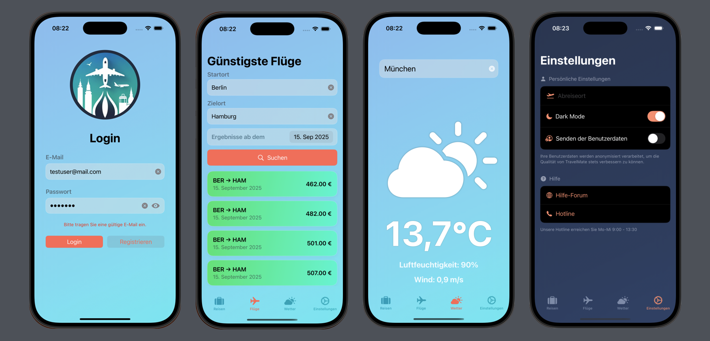

# TravelPlanner  

This SwiftUI app was developed as a **team project** for a client who requested a customizable travel planning application. ✈️🌍  
The client defined the requirements, but left the implementation details to the team. Together, we collaboratively designed and implemented the app, making use of **git branches** for structured teamwork.  

## Features  

- ✅ Search for and plan flights using the **Google Flight API (SerpAPI)**  
- ✅ Display local weather conditions with the **OpenWeatherMap API**  
- ✅ Use of **MVVM + R architecture** for clean code structure  
- ✅ Support for both **dummy data in Preview** and **real API data in Simulator**  
- ✅ Persistent storage of user data with integrated **databases**  
- ✅ Collaborative development workflow with **Git branching strategy**  
- ✅ Modern UI built with **SwiftUI**  

## Technologies  

- SwiftUI for the user interface  
- MVVM + R Model for architecture  
- OpenWeatherMap API for weather data  
- Google Flight API (via SerpAPI) for flight search  
- Databases for persistent storage  
- Git & GitHub for collaboration and version control  
- Dummy data for testing & live API data in simulator  

## How to Run  

1. Click the green **"Code"** button on this repository and select **"Open with Xcode"** (if available), or download the ZIP and open the project manually.  
2. Alternatively, open the `.xcodeproj` or `.xcworkspace` file directly in **Xcode**.  
3. Click the **Run** ▶️ button in the top toolbar to build and launch the app in the iOS Simulator or on a physical device.  
4. Use the app to plan trips, search flights, and check the weather at your destinations.  

---

📝 Disclaimer  

This project was developed as part of our training. The source code, structure, and documentation are our own work.  

© 2025  
- [Romina Reiber](https://github.com/RominaReiber)  
- [Oliver Bogumil](https://github.com/OliverBogumil)  
- [Mahbod Hamidi](https://github.com/mahbod5959)  
- Jeff Braun  

All rights reserved. Licensed under the [MIT License](./LICENSE).  
